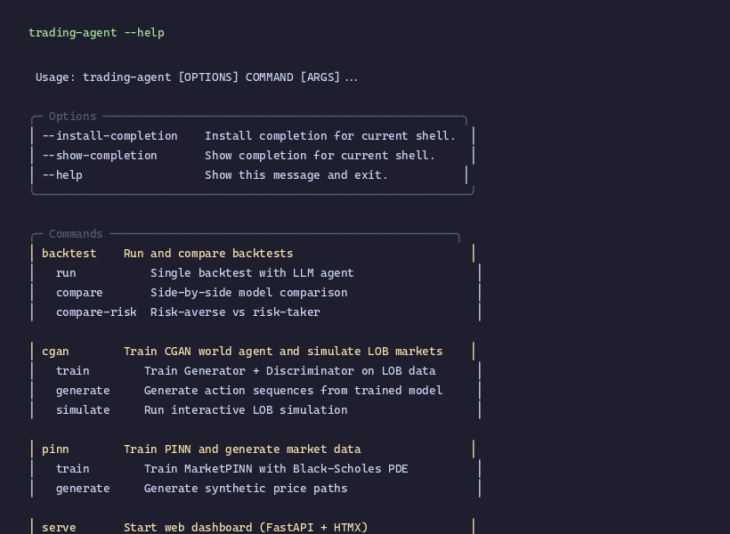

# Trading Agent

LLM-powered trading agent with LangGraph orchestration, backtesting, PINN and CGAN market simulation, and a React web dashboard.

<p align="center">
  
</p>

```
                    ┌──────────────┐
                    │   CLI (typer) │
                    └──┬───┬───┬───┘
                       │   │   │
         ┌─────────────┘   │   └──────────────┐
         ▼                 ▼                  ▼
   ┌──────────┐    ┌──────────────┐    ┌──────────────┐
   │ Backtest │    │  PINN/CGAN   │    │  Web (React) │
   │ Commands │    │  Commands    │    │  + JSON API  │
   └────┬─────┘    └──────┬───────┘    └──────┬───────┘
        │                 │                   │
        ▼                 ▼                   ▼
   ┌───────────────────────────────────────────────────┐
   │              trading_agent/ (Core)                │
   │  ┌────────┐  ┌──────────┐  ┌────────────────┐    │
   │  │  Core  │  │  Models  │  │   Market       │    │
   │  │ State, │  │ LLM Gate │  │   Sources      │    │
   │  │ Graph, │  │  ways    │  │ Polygon, Sim   │    │
   │  │ Nodes, │  │          │  │                │    │
   │  │ Reward │  │          │  │                │    │
   │  │ Cache  │  │          │  │                │    │
   │  └────────┘  └──────────┘  └────────────────┘    │
   │  ┌────────────┐  ┌────────────────────────────┐   │
   │  │  Strategy  │  │  Backtest Engine + Parallel │   │
   │  │   Cards    │  │  + Metrics + LLM Cache     │   │
   │  │  + Nodes   │  │                            │   │
   │  └────────────┘  └────────────────────────────┘   │
   │  ┌─────────────────────────────────┐              │
   │  │   Config (pydantic)             │              │
   │  └─────────────────────────────────┘              │
   └───────────────────────────────────────────────────┘
        │                 │                  │
        ▼                 ▼                  ▼
   ┌──────────┐    ┌──────────────┐    ┌──────────────┐
   │market_cgan│   │ market_pinn  │    │  web/        │
   │ CGAN Gen  │   │  PINN Model  │    │ FastAPI API  │
   │ Bar/LOB   │   │  BS PDE      │    │ + React SPA  │
   └──────────┘    └──────────────┘    └──────────────┘
```

## Features

- **LLM Agent** — LangGraph agent that decides BUY/SELL/HOLD using any LLM provider via LiteLLM
- **Strategy Cards** — MTG-inspired card system for composing trading strategies with mana budgets, rarity, and trade-offs
- **Multi-Provider LLM** — Kilo API, OpenAI, Anthropic, or any LiteLLM-supported provider
- **Reward Functions** — Risk-averse (`multicomponent_reward` with drawdown penalty) and risk-taker (`aggressive_reward` with volatility bonus)
- **Parallel Backtesting** — Compare N models concurrently using `ThreadPoolExecutor`. LLM response cache avoids repeat calls on identical market states (thread-local, LRU eviction).
- **Polygon.io Data** — Historical OHLCV aggregates and NBBO quotes via Polygon.io. No yfinance dependency.
- **CGAN Market Simulator** — Conditional GAN that learns market dynamics from real data, generates synthetic OHLCV bars or LOB sequences
- **PINN Market Simulator** — Physics-Informed Neural Network constrained by Black-Scholes PDE for synthetic price path generation
- **Web Dashboard** — React SPA (Vite + TypeScript) with FastAPI JSON backend. Deployable as static files independently.
- **Docker Deployment** — Multi-stage Dockerfile builds frontend + backend, one-command startup

## Quick Start

### Prerequisites

- Python 3.12+
- Node.js 20+ (for frontend development)
- pip
- [Polygon.io](https://polygon.io) API key (Starter plan $29/mo sufficient)

### Installation

```bash
git clone <repo-url> && cd trading-agent
pip install -e ".[web,pinn,dev,frontend]"
```

### Configuration

Copy and edit `.env` and set your Polygon API key:

```bash
cp .env.example .env
```

Key settings:

| Variable | Default | Description |
|---|---|---|
| `OPENAI_API_KEY` | — | Kilo API or OpenAI key for LLM calls |
| `KILO_API_BASE` | — | Custom API base URL for Kilo gateway |
| `ANTHROPIC_API_KEY` | — | Anthropic API key |
| `POLYGON_API_KEY` | — | **Required.** Polygon.io API key for all market data |
| `DATABASE_URL` | `sqlite:///data/trading.db` | Web dashboard database |
| `DEFAULT_MODEL` | `openai/gpt-4o-mini` | Default LLM for agent decisions |
| `FEE_RATE` | `0.001` | Trading fee rate per transaction |
| `RISK_LAMBDA` | `0.1` | Default risk penalty weight |
| `LOG_LEVEL` | `INFO` | Logging level |
| `LLM_CACHE_SIZE` | `1000` | Max cached LLM responses per thread |
| `LLM_CACHE_ENABLED` | `true` | Enable LLM response deduplication |

Settings are loaded via `get_settings()` (cached with `lru_cache`). The module-level `settings` singleton is still available for backward compatibility.

### Build Frontend

```bash
cd web/frontend && npm ci && npm run build
```

## CLI Reference

```bash
trading-agent --help
```

### Backtest Commands

```bash
# Run a single backtest (requires POLYGON_API_KEY)
trading-agent backtest run --symbol AAPL --steps 50

# Run a backtest with a strategy deck
trading-agent backtest run --symbol AAPL --deck aggro-deck --steps 50

# Compare multiple models side-by-side (parallel, ~4x faster)
trading-agent backtest compare --symbol AAPL --models "gpt-4o-mini,claude-sonnet" --workers 4

# Compare multiple decks
trading-agent backtest compare-decks --symbol AAPL --decks "aggro-deck,control-deck" --workers 2

# Compare risk-averse vs risk-taker (parallel)
trading-agent backtest compare-risk --symbol AAPL --steps 3600 --workers 2
```

### Strategy Cards Commands

```bash
# List all available strategy cards
trading-agent cards list

# Show detailed card info with stat bars
trading-agent cards show momentum-rider

# List saved decks
trading-agent cards deck-list

# Create a new deck
trading-agent cards deck-create --id aggro --name "Aggro" --cards "momentum-rider,stop-loss-sentinel,position-sizer" --mana 10

# Validate a deck
trading-agent cards deck-validate aggro
```

### CGAN Commands

```bash
# Train on synthetic data
trading-agent cgan train --epochs 100 --data-source synthetic

# Train on Polygon.io OHLCV aggregates (bar mode)
export POLYGON_API_KEY=poly_...
trading-agent cgan train --bar-mode --data-source polygon --polygon-ticker AAPL \
  --polygon-dates 2025-01-10,2025-01-13 --epochs 50

# Generate synthetic OHLCV bars from trained model
trading-agent cgan generate --model models/cgan/generator.pt --bar-mode --steps 252

# Run interactive OHLCV bar simulation
trading-agent cgan simulate --model models/cgan/generator.pt --bar-mode --steps 100
```

### PINN Commands

```bash
# Train PINN
trading-agent pinn train --symbol AAPL --epochs 1000

# Generate synthetic price paths
trading-agent pinn generate --model-id 1 --paths 100 --steps 252
```

### Web Dashboard

```bash
trading-agent serve
```

Then open `http://localhost:8000/app` for the React dashboard.

## Architecture

### Trading Agent Core (`trading_agent/`)

The agent is built as a **LangGraph** with configurable node graph. A `MarketAdapter` protocol decouples market data integration from graph construction — three adapters (`PriceMarketAdapter`, `LOBMarketAdapter`, `BarMarketAdapter`) handle price-only, LOB, and OHLCV bar data respectively. Custom adapters can be passed to `build_agent_graph` directly.

```
┌────────────────┐
│  MarketAdapter │  update_state() → price/LOB/bar data
└───────┬────────┘
        │
        ▼
┌──────────────────────────────────┐
│  decide_and_trade                │  LLM decides BUY/SELL/HOLD
│  - LLM response cache           │  Cache hit skips LLM call
│  - structured output via LCEL   │  Trade is executed, state updated
│  - text parsing fallback         │
└───────┬──────────────────────────┘
        │
        ▼
┌──────────────────────────────────┐
│  calculate_reward                │  portfolio_value change
│  - multicomponent_reward         │  risk penalties or volatility bonus
│  - aggressive_reward             │
└───────┬──────────────────────────┘
        │
        ▼
   (loop or END)
```

**Key files:**

| File | Purpose |
|---|---|
| `core/state.py` | `AgentState` TypedDict — cash, shares, price, history, portfolio values |
| `core/schemas.py` | `TradeDecision`, `LimitOrder`, `MarketOrder` — Pydantic LLM output schemas |
| `core/nodes.py` | `apply_trade` (pure accounting), `fetch_price`, `execute_trade`, `execute_lob_trade`, `calculate_reward |
| `core/graph.py` | `build_agent_graph` (unified, deck-aware), `MarketAdapter` protocol, `build_graph`/`build_lob_graph`/`build_bar_graph` (convenience wrappers) |
| `core/reward.py` | `multicomponent_reward` (risk-averse), `aggressive_reward` (risk-taker) |
| `core/cache.py` | `LLMResponseCache` — thread-local LRU cache deduplicating LLM calls |
| `cards/registry.py` | `CardRegistry` — loads JSON card definitions, provides `get_card`/`list_cards` |
| `cards/deck.py` | `Deck` — validation, mana budget, card composition, prompt modifier aggregation |
| `nodes/registry.py` | `StrategyNode` protocol, `@register_node` decorator, `NODE_REGISTRY` dict |
| `nodes/pre_trade.py` | `MomentumAnalyzer`, `ReversionAnalyzer`, `VolatilityAnalyzer`, `HoldReinforcer` |
| `nodes/post_trade.py` | `StopLossSentinel`, `PositionSizer`, `TrendFilter`, `PanicSell` |
| `nodes/reward.py` | `VolatilityReward`, `DrawdownImmune` — custom reward node implementations |
| `models/gateway.py` | `KiloGateway` — LiteLLM abstraction supporting 100+ providers |
| `models/mock.py` | `MockLLM` / `MockGateway` — always returns HOLD for testing |
| `market/simulators.py` | `RandomWalkMarket`, `HistoricalMarket` |
| `market/polygon_market.py` | `fetch_prices` — OHLCV price series via Polygon.io |
| `market/lob_source.py` | `CGANMarketSource` — bridges CGAN simulation into agent (duck-typed, no cross-package import) |
| `backtest/engine.py` | `backtest_agent`, `create_initial_state`, `compute_strategy_metrics` |
| `backtest/parallel.py` | `parallel_backtest` — N concurrent backtests via ThreadPoolExecutor |
| `backtest/metrics.py` | `compute_sharpe`, `compute_max_drawdown` |

#### Reward Functions

**`multicomponent_reward`** (risk-averse):

```
reward = profit − λ_drawdown × max(0, peak − new_value) − trade_cost
```

**`aggressive_reward`** (risk-taker):

```
reward = profit + λ_volatility × |profit| − trade_cost
```

### Strategy Cards (`trading_agent/cards/`, `trading_agent/nodes/`)

MTG-inspired card system for composing trading strategies. Each card encodes a strategy with stats, rarity, mana cost, and custom graph nodes.

**How it works:**

1. Cards are JSON files with metadata (name, rarity, stats) and references to Python node implementations
2. Players build **decks** of cards within a mana budget (default 10)
3. Cards can inject **pre_trade** nodes (analyze before LLM decides), **post_trade** nodes (filter/veto trades), or **reward** nodes (custom reward calculation)
4. All card prompt modifiers are concatenated into the LLM system prompt

```
Default graph:
  update_market → decide_and_trade → calculate_reward → loop

Deck-assembled graph:
  update_market → [pre_trade nodes] → decide_and_trade → [post_trade nodes] → [reward node] → loop
```

**Starter Cards (8):**

| Card | Rarity | Mana | Nodes | Reward |
|---|---|---|---|---|
| Momentum Rider | Rare | 3 | `momentum_analyzer` | aggressive |
| Mean Reversion Mage | Rare | 3 | `reversion_analyzer` | multicomponent |
| Volatility Vampire | Epic | 4 | `volatility_analyzer`, `volatility_reward` | custom |
| Stop-Loss Sentinel | Common | 1 | `stop_loss_sentinel` | — |
| Position Sizer | Common | 1 | `position_sizer` | — |
| Trend Filter | Common | 2 | `trend_filter` | — |
| Diamond Hands | Legendary | 5 | `hold_reinforcer`, `drawdown_immune` | aggressive |
| Paper Hands | Common | 1 | `panic_sell` | — |

**Key files:**

| File | Purpose |
|---|---|
| `cards/*.json` | Card definitions with stats, rarity, mana cost, flavor text |
| `cards/registry.py` | `CardRegistry` singleton, loads all JSON cards at startup |
| `cards/deck.py` | `Deck` class with validation, mana budget, card composition |
| `nodes/registry.py` | `StrategyNode` protocol, `@register_node` decorator, `NODE_REGISTRY` |
| `nodes/pre_trade.py` | `MomentumAnalyzer`, `ReversionAnalyzer`, `VolatilityAnalyzer`, `HoldReinforcer` |
| `nodes/post_trade.py` | `StopLossSentinel`, `PositionSizer`, `TrendFilter`, `PanicSell` |
| `nodes/reward.py` | `VolatilityReward`, `DrawdownImmune` |

### CGAN Market Simulator (`market_cgan/`)

Conditional GAN that generates synthetic market data. Two modes:

**Bar mode (Polygon-driven):** Generator produces OHLCV bars from 6-dim features. Replaces the older LOB-based approach.

**LOB mode (legacy):** Generator produces limit-order-book actions (action_type, side, price_offset, quantity) from 42-dim LOB snapshot features.

```
┌──────────┐    noise (64d)
│ Generator│    features (6d bar or 42d LOB)
│   MLP    │    ──────────────────────────────►
│ 256-256- │    OHLCV (bar) or action (LOB)
│ 128      │
└──────────┘
```

**Key files:**

| File | Purpose |
|---|---|
| `models/bar_generator.py` | `BarGenerator` — 6-head MLP for OHLCV bar generation |
| `models/generator.py` | `Generator` — 4-head MLP for LOB action generation (legacy) |
| `models/discriminator.py` | `Discriminator` — 4-layer MLP binary classifier |
| `data/bar.py` | `Bar`, `BarFeatureExtractor`, `BarDataset`, `FEATURE_OPEN`/`HIGH`/`LOW`/`CLOSE`/`VOLUME`/`VWAP` constants |
| `data/polygon.py` | `PolygonDataSource`, `PolygonDataset` — real data via Polygon.io |
| `data/features.py` | `MarketFeatureExtractor` — 42-dim feature vector from LOB |
| `training/trainer.py` | `train_gan` (shared loop), `train_cgan` (LOB wrapper), `train_cgan_bar` (bar wrapper) |
| `simulation/bar_exchange.py` | `BarExchange` — OHLCV bar accumulator |
| `simulation/bar_world_agent.py` | `BarWorldAgent` — CGAN-driven bar simulation agent |
| `simulation/exchange.py` | `OrderBook`, `LOBExchange` — LOB matching engine (legacy) |

### PINN Market Simulator (`market_pinn/`)

Physics-Informed Neural Network for synthetic price path generation.

```
Input: (t, S) ─► Linear ─► Tanh ─► [ResidualBlock × N] ─► Linear ─► V(t,S)
                    ▲              │
                    └──────────────┘
```

**Loss:** `L = w_data × MSE(V(t,S), market_price) + w_pde × MSE(PDE_residual, 0)`

PDE constraint is the **Black-Scholes equation**:

```
∂V/∂t + r·S·∂V/∂S + ½·σ²·S²·∂²V/∂S² − r·V = 0
```

**Key files:**

| File | Purpose |
|---|---|
| `models/pinn.py` | `MarketPINN` — deep residual network |
| `physics/black_scholes.py` | `bs_pde_residual` — autograd-based PDE residual |
| `training/dataset.py` | `MarketDataset` — wraps pandas price series |
| `training/losses.py` | `pinn_loss` — weighted data + PDE loss |
| `training/trainer.py` | `train_pinn` — standard PyTorch training |
| `synthesis/generator.py` | `generate_price_paths` — synthetic path generation |

### Web Dashboard (`web/`)

FastAPI JSON API + React SPA (Vite + TypeScript):

```
JSON API endpoints (FastAPI):
/api/dashboard          → recent backtest runs
/api/backtests          → all runs
/api/backtests/{id}     → run detail with steps
/api/backtests/new      → start new backtest (supports deck_id)
/api/backtests/compare  → parallel compare N models
/api/models/compare     → aggregated model comparison
/api/cards              → list all strategy cards
/api/cards/{id}         → card detail
/api/decks              → list saved decks
/api/decks/{id}         → deck detail with resolved cards
/api/decks (POST)       → create deck with validation
/api/decks/{id} (DELETE)→ delete deck
/api/pinn/models        → trained PINN models

React SPA routes (Vite, served at /app/*):
/app                    → dashboard (recent runs)
/app/backtests          → list all runs
/app/backtests/new      → new backtest form (deck selector)
/app/backtests/{id}     → run detail
/app/cards              → card collection with filters
/app/decks              → deck builder with mana validation
/app/models/compare     → model comparison
/app/pinn/train         → PINN training form
/app/pinn/generate      → PINN generation form
```

Jinja2 templates still available at legacy routes (`/`, `/backtests`, etc.) for backward compatibility.

### Data Sources

| Source | Type | Cost | Data Provided |
|---|---|---|---|
| **Polygon.io Starter** | OHLCV aggregates + NBBO | $29/mo | Historical minute/day bars, top-of-book quotes, 5-yr history |
| **Polygon.io Advanced** | NBBO + WebSocket | $199/mo | + real-time streaming |
| **LOBSTER** | NASDAQ L3 | €500-€2000 | Full order book depth (real) |
| **Synthetic** | Generated | Free | Random walk data |

## Testing

```bash
# All tests
pytest

# Specific areas
pytest tests/test_cards/
pytest tests/test_cgan/
pytest tests/test_pinn/
pytest tests/test_core/
pytest tests/test_backtest/

# Card system tests
pytest tests/test_cards/test_registry.py
pytest tests/test_cards/test_nodes.py
pytest tests/test_cards/test_deck.py

# With coverage
pytest --cov=. --cov-report=term-missing
```

Currently **209 tests** across all modules.

## Docker

```bash
docker compose up
```

The multi-stage Dockerfile builds the React frontend with Node 20, then packages it with the Python backend. Opens `http://localhost:8000`.

## Project Structure

```
trading-agent/
├── cli/                    # Typer command-line interface
│   ├── main.py             # Root dispatcher (backtest, pinn, cgan, serve, cards)
│   ├── backtest_cmd.py     # run, compare, compare-risk, compare-decks (parallel)
│   ├── cards_cmd.py        # cards list/show, deck list/create/validate
│   ├── cgan_cmd.py         # train, generate, simulate
│   ├── pinn_cmd.py         # train, generate
│   └── serve_cmd.py        # serve (uvicorn)
├── trading_agent/          # Core library
│   ├── core/               # State, graph, nodes, reward, schemas, cache
│   ├── cards/              # Strategy cards: JSON defs, registry, deck model
│   ├── nodes/              # Pluggable graph nodes: pre_trade, post_trade, reward
│   ├── models/             # LLM gateway (Kilo, Mock)
│   ├── market/             # Data sources (Polygon, simulators, LOB)
│   ├── backtest/           # Engine + metrics + parallel runner
│   └── config/             # Pydantic settings
├── market_cgan/            # Conditional GAN for market simulation
│   ├── models/             # BarGenerator, Generator, Discriminator
│   ├── data/               # Bar features, LOBSTER parser, Polygon.io adapter
│   ├── training/           # Losses, trainer, physics-informed loss
│   └── simulation/         # BarExchange, LOBExchange, WorldAgent
├── market_pinn/            # Physics-Informed NN for price synthesis
│   ├── models/             # MarketPINN
│   ├── physics/            # Black-Scholes PDE
│   ├── training/           # Dataset, loss, trainer
│   └── synthesis/          # Path generator
├── web/                    # FastAPI backend + React frontend
│   ├── frontend/           # Vite + React SPA (TypeScript)
│   ├── routers/            # API + HTML route handlers
│   ├── db/                 # SQLAlchemy models + database
│   ├── templates/          # Jinja2 templates (legacy)
│   └── static/             # Static assets
├── docker/                 # Multi-stage Dockerfile + compose
├── tests/                  # 209 pytest tests
│   ├── test_cards/         # Card registry, nodes, deck validation
│   ├── test_cgan/
│   ├── test_pinn/
│   ├── test_core/          # Includes test_cache.py
│   ├── test_backtest/      # Includes test_parallel.py
│   ├── test_market/
│   ├── test_models/
│   └── test_web/
└── scripts/                # Standalone utility scripts
```

## Development

```bash
# Install Python dependencies
pip install -e ".[web,pinn,dev]"

# Install and build frontend
cd web/frontend && npm ci && npm run build

# Or run frontend dev server (auto-reloads on changes)
cd web/frontend && npm run dev  # proxies /api to localhost:8000

# Run tests
pytest -v

# Start web dashboard (serves React build at /app/*)
trading-agent serve
```

## Performance Notes

- **Parallel backtesting:** `compare` and `compare-risk` commands run N backtests concurrently via `ThreadPoolExecutor`. With 4 workers, comparing 4 models takes ~30s instead of ~120s (LLM calls are I/O-bound).
- **LLM response cache:** Each thread maintains its own LRU cache of recent LLM decisions. On flat or oscillating markets, ~30-50% of LLM calls are eliminated.
- **Data fetching:** Historical prices fetched via Polygon.io aggregates. Single-symbol fetch is I/O-bound (~1-3s).